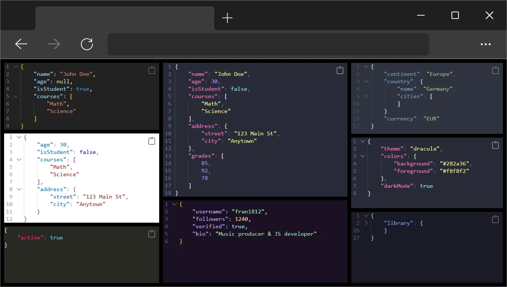

# JSON Visualizer custom element



## Examples

- [**Codepen**](https://codepen.io/collection/JYEwMK): 
[`Overview`](https://codepen.io/FrancoJavierGadea/pen/YPyVZMo)
[`json attribute`](https://codepen.io/FrancoJavierGadea/pen/EaVmWze)
[`custom icons`](https://codepen.io/FrancoJavierGadea/pen/KwdmWjv)
[`render deep`](https://codepen.io/FrancoJavierGadea/pen/ZYbKedr)
[`Changing themes`](https://codepen.io/FrancoJavierGadea/pen/WbQjpWR)
[`src attribute`](https://codepen.io/FrancoJavierGadea/pen/qEOmrzg)

- [**Stackblitz**]():
[Overview](https://stackblitz.com/edit/vitejs-vite-uplxn9zh?file=index.html)


<br>

## Installation

#### NPM

```bash
npm install @components-1812/json-visualizer
```

- [`JSON visualizer package`](https://www.npmjs.com/package/@components-1812/json-visualizer)

#### CDN

```html
<script type="module">
    import JSONVisualizer from 'https://cdn.jsdelivr.net/npm/@components-1812/json-visualizer@0.0.3/src/JSONVisualizer.min.js';

    //Load the stylesheet
    JSONVisualizer.stylesSheets.links.push('https://cdn.jsdelivr.net/npm/@components-1812/json-visualizer@0.0.3/src/JSONVisualizer.min.css');

    console.log(JSONVisualizer);

    customElements.define('custom-json-visualizer', JSONVisualizer);
</script>
```

- **jsdelivr**: [`JSON visualizer package`](https://www.jsdelivr.com/package/npm/@components-1812/json-visualizer)
[`JSONVisualizer.js`](https://cdn.jsdelivr.net/npm/@components-1812/json-visualizer@0.0.3/src/JSONVisualizer.min.js)
[`JSONVisualizer.css`](https://cdn.jsdelivr.net/npm/@components-1812/json-visualizer@0.0.3/src/JSONVisualizer.css)
[`JSONTokenizer.js`](https://cdn.jsdelivr.net/npm/@components-1812/json-visualizer@0.0.3/src/JSONTokenizer.js)

- **unpkg**: [`JSON visualizer package`](https://app.unpkg.com/@components-1812/json-visualizer)
[`JSONVisualizer.js`](https://unpkg.com/@components-1812/json-visualizer@0.0.3/src/JSONVisualizer.js)
[`JSONVisualizer.css`](https://unpkg.com/@components-1812/json-visualizer@0.0.3/src/JSONVisualizer.css)
[`JSONTokenizer.js`](https://unpkg.com/@components-1812/json-visualizer@0.0.3/src/JSONTokenizer.js)

<br>

## Usage

If you use Vite or a framework based on Vite such as Astro, you can import the component in a client-side script file:

```js
import '@components-1812/json-visualizer';
```

and use it in your HTML:

```html
<custom-svg-isolate>
    {
        "name": "John Doe",
        "age": null,
        "isStudent": false,
        "courses": ["Math", "Science"],
        "address": {
            "street": "123 Main St",
            "city": "Anytown"
        },
        "grades": [ 85, 92, 78 ],
        "contact": {
            "email": "john.doe@example.com",
            "phone": "123-456-7890"
        }
    }
</custom-svg-isolate>

<custom-json-visualizer json='{"name": "John Doe", "age": null}'></custom-json-visualizer>

<custom-json-visualizer src="https://jsonplaceholder.typicode.com/todos/1"></custom-json-visualizer>
```

> **Note:**
> 
> If you are using a builder or framework that doesn't support import ?raw, you need to load the component and its stylesheets manually.
> 
> see [Adding CSS stylesheets manually](#adding-css-stylesheets-manually)


<br>

## Adding CSS stylesheets manually

If you want to add custom stylesheets to the component or need to load stylesheets from a different path, you can do it like this:

- ### AdoptedStyleSheets (recommended)

    Using your builder’s import raw method, `CSSStyleSheet`, and the component’s `AdoptedStyleSheets` property:

    ```js
    import JSONVisualizer from "@components-1812/json-visualizer/JSONVisualizer.js";
    import JSONVisualizerRawCSS from "@components-1812/json-visualizer/JSONVisualizer.css?raw";

    //Add the stylesheets to the component
    const JSONVisualizerCSS = new CSSStyleSheet();

    JSONVisualizerCSS.replaceSync(JSONVisualizerRawCSS);

    JSONVisualizer.stylesSheets.adopted.push(JSONVisualizerCSS);

    //Define the component
    import('@components-1812/json-visualizer/define');
    ```

- ### Raw CSS in a `<style>` tag

    Using a `<style>` tag inside the shadow root of the component:

    ```js
    import JSONVisualizer from "@components-1812/json-visualizer/JSONVisualizer.js";
    import JSONVisualizerRawCSS from "@components-1812/json-visualizer/JSONVisualizer.css?raw";

    //Add the stylesheets to the component
    JSONVisualizer.stylesSheets.raw.push(JSONVisualizerCSS);

    //Define the component
    import('@components-1812/json-visualizer/define');
    ```

- ### External CSS files in a `<link>` tag

    Using a `<link>` tag inside the shadow root of the component:

    ```js
    import JSONVisualizer from "@components-1812/json-visualizer/JSONVisualizer.js";
    import JSONVisualizerCSS from "@components-1812/json-visualizer/JSONVisualizer.css?url";

    //Add the stylesheets to the component
    JSONVisualizer.stylesSheets.links.push(JSONVisualizerCSS);

    //Define the component
    import('@components-1812/json-visualizer/define');
    ```

> **Note:**
> 
> `import('@components-1812/json-visualizer/define')` calls `customElements.define('custom-json-visualizer', JSONVisualizer);` in `define.js`

<br>

## Customization

### CSS variables

```css
--line-height: 1.25;
--line-elements-gap: 5px;
--line-white-space: normal;
--font: Consolas, "Courier New", monospace, sans-serif;

--line-number-padding: 5px;
--line-number-color: #777;
--line-number-background: transparent;
--line-number-text-align: right;
--line-number-width: fit-content;
--line-number-min-width: 2ch;/* Set by JS according to JSON line count */

--toggle-button-width: 15px;
--toggle-button-color: #777;
--toggle-button-hover-color: #fff;
--toggle-button-padding: 0;

--copy-button-width: 40px;
--copy-button-height: 40px;
--copy-button-color: #777;
--copy-button-hover-color: #fff;
--copy-button-padding: 10px;

--indentation-guides-lines-color: #444;
--indentation-guides-lines-width: 1px;
    
--json-tab-size: 4ch;

/* Theme Colors */
--json-background: #222;
--json-foreground: #eee;

--json-key: #9cdcfe;           
--json-string: #ce9178;        
--json-number: #b5cea8;        
--json-boolean: #569cd6;       
--json-null: #dcdcaa;  

--json-brace: #ffd700;         
--json-bracket: #ffd700;       
--json-comma: #d4d4d4;         
--json-colon: #d4d4d4; 
```

### Themes 

You can use one of the existing themes located in the [assets/themes](./assets/themes) folder.

Example with Vite (or other bundlers):

```js
import "@components-1812/json-visualizer/assets/themes/nord.css"
```

Example with CDN:

```html
<link rel="stylesheet" href="https://unpkg.com/@components-1812/json-visualizer@0.0.3/assets/themes/dracula.css">
```

Then apply the theme by using the corresponding class name:

```html
<custom-json-visualizer class="dracula"></custom-json-visualizer>
<custom-json-visualizer class="nord"></custom-json-visualizer>
```

> **Note:**
>
> All themes are based on the default `<custom-json-visualizer>` tag name.
>
> If you register the custom element under a different name, you’ll need to adjust the theme’s CSS selectors accordingly.

Show all available themes in this example: [Changing themes](https://codepen.io/FrancoJavierGadea/pen/WbQjpWR)

### Custom icons

If you want to add your own icons to the component, you can do it like this:

Use a `<template>` tag with the slot="icons" attribute, and assign a data-name to each icon using one of the following values: toggle, copy, or copy-done.

```html
<custom-json-visualizer>
    {
        "name": "John Doe",
        "age": null,
        "isStudent": false,
        "courses": ["Math", "Science"],
    }
    <template slot="icons">
        <span data-name="toggle">🔽</span>
        <span data-name="copy">📋</span>
        <span data-name="copy-done">✅</span>
    </template>
</custom-json-visualizer>
```
> **Note:**
>
> You can retrieve icons using the `getIcon(name)` method.
>
> To get a cloned copy of the icon instead of a reference, use `getIcon(name, { clone: true })`.

### Custom tokenizer

The default tokenizer in [`JSONTokenizer.js`](./src/JSONTokenizer.js) has been tested a lot (see [tests](./test/)) and works well with any valid JSON input.

However, if you prefer to use your own tokenizer, you can override the default behavior via `JSONVisualizer.getTokens`:

```js
import JSONVisualizer from "@components-1812/json-visualizer";

JSONVisualizer.getTokens = async (rawJson) => {

    return [];//[{type, value, tags}, ...]
}
```
Each token should follow this structure:
```ts
type Token = {
    type:'brace-open' | 'brace-close' | 'bracket-open' | 'bracket-close' | 'colon' | 'comma' | 'string' | 'number' | 'boolean' | 'null',
    value:string | boolean | number | null,
    tags:Array<'brace' | 'bracket' | 'colon' | 'comma' | 'string' | 'number' | 'boolean' | 'null' | 'open' | 'close' | 'key' | 'value' | 'array-value'>,
}
```
> **Note:**
>
> The `type` property is required for the JSON to render correctly.
>
> The `tags` array is used for syntax highlighting.
>
> The `color` and `url` properties are used to render a visual preview or clickable link.

Aqui puedes ver un ejemplo usando `babel-standalone`: [custom tokenizer](https://codepen.io/FrancoJavierGadea/pen/RNWVpXw)

<br><br>

## Color Preview

```html
<!-- Default -->
<custom-json-visualizer colors="all"></custom-json-visualizer>

<!-- All color type supported -->
<custom-json-visualizer colors="hex, rgb, rgba, hsl, hsla, named"></custom-json-visualizer>

<!-- Disable color preview -->
<custom-json-visualizer colors="none"></custom-json-visualizer>
```

```js
const jsonVisualizer = document.querySelector('custom-json-visualizer');

jsonVisualizer.colors = 'all';
jsonVisualizer.colors = 'none';
jsonVisualizer.colors = null;
jsonVisualizer.colors = 'hex, rgb, rgba, hsl, hsla, named';
jsonVisualizer.colors = ['hex', 'rgb', 'rgba', 'hsl', 'hsla', 'named'];
jsonVisualizer.colors = new Set(['hex', 'rgb', 'rgba', 'hsl', 'hsla', 'named']);

jsonVisualizer.colors;//<- Set<String>
```

> **Note:**
>
> `<span>` Tokens representing colors are marked with `tags="color color-<color type> ..."`

<br>

## Clickable Links

```html
<!-- Default -->
<custom-json-visualizer urls="all"></custom-json-visualizer>

<!-- All URL types supported -->
<custom-json-visualizer urls="http, https, ftp, www, domain, relative, mail, phone"></custom-json-visualizer>

<!-- Disable clickable links -->
<custom-json-visualizer urls="none"></custom-json-visualizer>
```

> **Note:**
>
> `<span>` Tokens representing URLs are marked with `tags="url url-<url type> ..."`


<br><br>

## Attributes

#### Reactive attributes

- `src`: URL used to fetch a JSON file.

    If the `src` attribute is not set, the component will use either the `json` attribute or its `textContent` during initialization.

- `json`: A raw JSON string to render directly.

#### Non reactive atributes

- `line-numbers`:  Controls whether line numbers are rendered. Set to `"none"` to hide them.

- `toggle-lines`: Controls whether toggle buttons for collapsible sections are shown. Set to `"none"` to hide them.

- `indentation-guides-lines`: Shows indentation guide lines. Set to `"none"` to hide them.

- `copy-button`: Controls whether the copy button are rendered. Set to `"none"` to hide it.

<br>

- `render-deep` default: `Infinity`: Limits the initial rendering depth for **deeply nested JSON**. 

    Any non-numeric value is treated as `Infinity`. 

    Deeper levels will only be rendered when expanded by the user.

<br>

- `colors` default: `all`: Controls that **color types** show a preview.

    Set to `colors="all"` to enable color preview for all recognized color types: `hex`, `rgb`, `rgba`, `hsl`, `hsla`, `named`

    Set to Comma-separated list: `colors="hex, rgb, rgba, hsl, hsla, named"` 

    Set to `colors="none"` to hide it.

<br>

- `urls` default: `all`: Controls that **URL types** show a preview.

    Set to `urls="all"` to enable clickable links for all recognized URL types: `http`, `https`, `ftp`, `relative`, `mail`, `phone`

    Set to Comma-separated list: `urls="http, https, ftp, relative, mail, phone"` 

    Set to `urls="none"` to hide it.

<br>

- `folded-message`: The message displayed between lines when a section is folded. 
    The default is: \22ef (middle dots: ⋯) when not set.

    Set a custom message to display when the section is folded, for example: `folded-message="folded items..."`
    
    You can use the `{content_lenght}` variable in the custom message: 

    ```html
    <custom-json-visualizer folded-message="{content_lenght} folded items..."></custom-json-visualizer>
    ```

    Set `folded-message="none"` to hide it.

    > **Note**
    >
    > Internally, the folded-message attribute is used to set the CSS variable `--json-folded-message-content`.
    >
    > You can try setting it manually if needed, but the recommended way is to use the attribute directly

<br><br>

#### Ready attributes

- `ready`: Set when the component is fully initialized (at the end of `connectedCallback()`).

- `ready-links`: Set when external stylesheets from `JSONVisualizer.stylesSheets.links` have finished loading.

- `ready-json`: Set when the JSON has been successfully loaded and rendered.

<br>

## Properties

#### Mirrors of Attributes

These properties reflect the corresponding HTML attributes:

- `json` (reactive): A raw JSON string to render. Updating this will trigger a re-render.

- `data` (readonly): Returns the parsed result of the current `json` value (`JSON.parse(json)`). If parsing fails, returns `null`.

- `src` (reactive): A URL to fetch a JSON file. Updating this will also trigger a re-render.

<br>

- `lineNumbers`: Controls whether line numbers are shown. Use "none" to hide them.

- `toggleLines`: Controls whether toggle buttons are shown.

- `indentationGuidesLines`: Controls the visibility of indentation guide lines.

- `copyButton`: Controls the visibility of the copy button.

<br>

- `renderDeep`: Limits the initial rendering depth for deeply nested JSON.

    **Returns** a `number` of `render-deep` attribute or `Infinity`

<br>

- `colors`: Controls which color types should display a visual preview
    
    **Returns**:
    
    - A `Set<string>` containing the types listed in the `colors="rgb, hsl, ..."` attribute.

    - An empty `Set` when `colors="none"`.

    - A `Set` with all supported **color types** (as defined by `JSONVisualizer.defaults.colors`) when `colors="all"`

<br>

- `urls`: Controls which URL types should be rendered as clickable links

    **Returns** 
    
    - A `Set<string>` containing the types listed in the `urls="http, https, ..."` attribute.
    
    - An empty `Set` when `urls="none"`

    - A `Set` with all supported **URL types** (as defined by `JSONVisualizer.defaults.urls`) when `urls="all"`


<br><br>

## Methods

- `async renderJSON(raw, options?)`

    Clears the currently rendered JSON and renders the new one using the given options.

    raw can be a string or parsed object.

- `clearJSON()`

    Clears the currently rendered JSON content.

- `async loadJSON(url, options?)`

    Fetches a JSON file from the specified URL and renders it using the given options.

- `getIcon(name, { clone = false })` 

    Retrieves one of the internal icons used for the toggle or copy buttons.

    Valid `name` values: "toggle", "copy", "copy-done".

    Pass `{ clone: true }` to get a cloned copy of the icon instead of a reference.

- `clearListeners()`

    Removes all internal event listeners used by the component.


## Events

- `ready`:  Fired when the component has finished initializing (at the end of `connectedCallback()`).

- `ready-links`: Fired when the stylesheets defined in `JSONVisualizer.stylesSheets.links` are loaded.

    ```js
    document.querySelector('custom-json-visualizer').addEventListener('ready-links', (e) => {

        const {results} = e.detail;

        console.log(results);//[{link:HTMLLinkElement, href:string, status:'loaded' | 'error'}, ...]
    });
    ```

- `ready-json`: Fired when the JSON has been successfully loaded and rendered.

- `copy-done`: Fired when the copy button is clicked and the JSON data has been copied to the clipboard.

    ```js
    document.querySelector('custom-json-visualizer').addEventListener('copy-done', (e) => {

        const {data} = e.detail;
    });
    ```

<br>

## JSONTokenizer 

```js
import JSONTokenizer from '@components-1812/json-visualizer/JSONTokenizer.js';

const tokenizer = new JSONTokenizer(); 

tokenizer.tokenize(rawJson);

console.log(tokenizer.tokens);//[{type, value, tags}, ...]
```

## License

This package is distributed under the [MIT license](./LICENSE).

## Credits

Default icons used in this package are sourced from the [Bootstrap Icons](https://icons.getbootstrap.com/) project, licensed under the MIT license.  
© 2019–2024 The Bootstrap Authors 

- [clipboard](https://icons.getbootstrap.com/icons/clipboard/)
- [chevron-down](https://icons.getbootstrap.com/icons/chevron-down/)
- [check](https://icons.getbootstrap.com/icons/check2/)